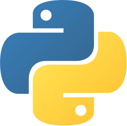
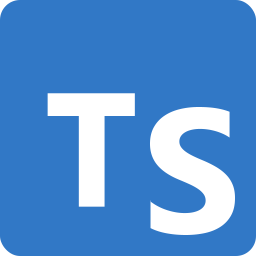

# python2ts

<div align="center">


&nbsp;&nbsp;&nbsp;
<strong style="font-size: 2em">→</strong>
&nbsp;&nbsp;&nbsp;


**Write Python. Ship TypeScript. Run Everywhere.**

[](https://github.com/sebastian-software/python2ts/actions/workflows/ci.yml)
[](https://codecov.io/gh/sebastian-software/python2ts/flags)
[](https://codecov.io/gh/sebastian-software/python2ts/flags)
[](https://github.com/sebastian-software/python2ts/blob/main/LICENSE)

[Homepage](https://sebastian-software.github.io/python2ts/) ·
[Documentation](https://sebastian-software.github.io/python2ts/docs/) ·
[API Reference](https://sebastian-software.github.io/python2ts/docs/api)

</div>

---

Python dominates AI, ML, and data science. TypeScript powers modern web applications. **python2ts**
brings them together — transpile Python to production-ready TypeScript with full type safety.

## Packages

| Package                               | Description                               | Version                                                                                       |
| ------------------------------------- | ----------------------------------------- | --------------------------------------------------------------------------------------------- |
| [**python2ts**](./packages/python2ts) | AST-based Python to TypeScript transpiler | [](https://www.npmjs.com/package/python2ts) |
| [**pythonlib**](./packages/pythonlib) | Python standard library for TypeScript    | [](https://www.npmjs.com/package/pythonlib) |

## Quick Example

**Python input:**

```python
def fibonacci(n: int) -> list[int]:
    a, b = 0, 1
    result = []
    for _ in range(n):
        result.append(a)
        a, b = b, a + b
    return result
```

**TypeScript output:**

```typescript
import { range } from "pythonlib"

function fibonacci(n: number): number[] {
  let [a, b] = [0, 1]
  let result: number[] = []
  for (const _ of range(n)) {
    result.push(a)
    ;[a, b] = [b, a + b]
  }
  return result
}
```

## Why python2ts?

- **Prototype in Python, deploy in TypeScript** — Keep your AI/ML workflows, ship to any JS runtime
- **Run anywhere JavaScript runs** — Browsers, Node.js, Deno, Bun, Cloudflare Workers, AWS Lambda
- **Type safety included** — Python type hints become TypeScript types automatically
- **Full standard library** — itertools, functools, collections, datetime, re, and more

## Runtime Support

Tested on every commit:

<p>
  
  &nbsp;&nbsp;
  
  &nbsp;&nbsp;
  
  &nbsp;&nbsp;
  
</p>

**Node.js** (v22, v24) · **Bun** · **Deno** · **Browsers** (via Playwright)

## Documentation

| Resource                                                                       | Description                              |
| ------------------------------------------------------------------------------ | ---------------------------------------- |
| [Homepage](https://sebastian-software.github.io/python2ts/)                    | Project overview and features            |
| [Getting Started](https://sebastian-software.github.io/python2ts/docs/)        | Installation and first steps             |
| [Syntax Reference](https://sebastian-software.github.io/python2ts/docs/syntax) | Python → TypeScript transformation rules |
| [Runtime Library](https://sebastian-software.github.io/python2ts/docs/runtime) | Using pythonlib modules                  |
| [API Reference](https://sebastian-software.github.io/python2ts/docs/api)       | Complete API documentation               |

## Development

```bash
pnpm install    # Install dependencies
pnpm build      # Build all packages
pnpm test       # Run tests (1400+ tests)
pnpm lint       # Lint code
```

## Architecture

Key design decisions are documented in [docs/adr/](./docs/adr/):

- [ADR-0001](./docs/adr/0001-use-lezer-python-parser.md) — Lezer Python Parser
- [ADR-0009](./docs/adr/0009-subpath-exports-architecture.md) — Subpath Exports
- [ADR-0010](./docs/adr/0010-monorepo-package-structure.md) — Monorepo Structure

## Requirements

- Node.js >= 22.0.0
- pnpm >= 9.0.0

## License

MIT © [Sebastian Software GmbH](https://sebastian-software.de)
